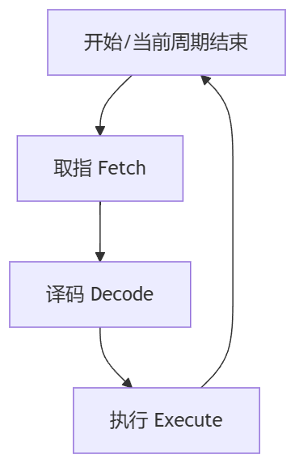
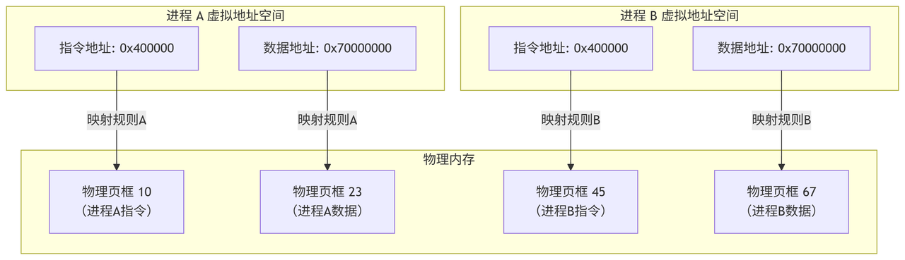
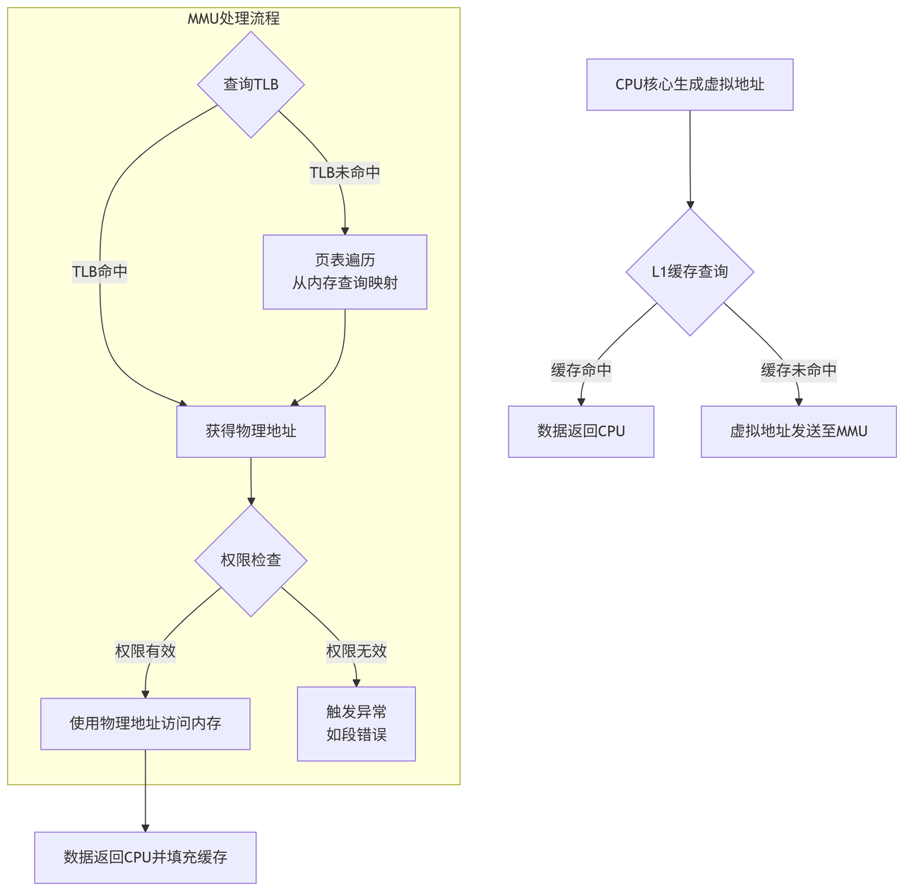

# 本文大纲

1. 引言

2. 指令、内存与取指

3. 内存隔离 -- 虚拟地址

4. 页表翻译 -- MMU

# 引言

计算机软件的发展始终与硬件演进息息相关。在现代计算系统中，内存管理单元（MMU）和缓存（Cache）是CPU中至关重要的内存访问硬件模块，它们直接影响着软件的性能和功能特性。从8位单片机到64位高性能处理器，CPU的内存访问方式经历了革命性的变化。

本文将带领大家深入了解Arm64架构中的MMU模块，从基础概念到实现原理，为有一定软件开发经验但硬件知识有限的读者提供一份清晰的"入门路书"。

# 1. 指令、内存与取指

## 1.1 冯·诺依曼架构基础

1945年，数学家约翰·冯·诺依曼提出了"存储程序计算机"的概念，这一理念至今仍是绝大多数计算机设计的基础。理解这一架构不仅是对计算机历史的回顾，更是理解现代处理器（包括Arm64）中MMU和内存管理系统设计初衷的关键。

> 冯·诺依曼架构包含五个基本组成部分：
>
> 1. 中央处理单元（CPU）：负责执行指令和处理数据
>
> 2. 存储器（Memory）：统一存储指令和数据
>
> 3. 输入设备：接收外部数据
>
> 4. 输出设备：向外部发送数据
>
> 5. 控制总线：连接各组件的数据、地址和控制信号通道

冯·诺依曼最关键的贡献是提出了"存储程序"概念：指令和数据以二进制形式共同存储在同一个存储器中。这一简单却革命性的想法带来了几个深远影响：

1. 程序可当作数据处理

程序本身可以像数据一样被修改、分析和生成，这为编译器、调试器甚至现代操作系统的诞生奠定了基础。

* 顺序执行模型

CPU通过一个称为程序计数器（Program Counter, PC） 的特殊寄存器来确定下一步要执行的指令位置。执行完一条指令后，PC通常自动递增，指向下一条指令，形成顺序执行流程。

```plain&#x20;text
// 简化版的指令执行循环
while (true) {
    instruction = memory[PC];  // 根据PC取指令
    execute(instruction);      // 执行指令
    PC += instruction_length;  // 更新PC指向下一条指令
}
```

## 1.2 CPU的顺序执行与取指

在现代计算机中，CPU（中央处理器）就像是计算机的“大脑”，它的核心工作是一个周而复始的循环，即著名的取指-译码-执行周期（Fetch-Decode-Execute Cycle）。这个循环是冯·诺依曼“存储程序”概念的具体实现。

下图清晰地展示了这个永不停息的循环过程：



```plain&#x20;text
flowchart TD
A["开始/当前周期结束"] --> B[取指 Fetch]
B --> C[译码 Decode]
C --> D[执行 Execute]
D --> A
```

下面我们来详细分解每一个步骤：

1. 取指（Fetch）：

   * CPU内部有一个非常重要的寄存器，叫做程序计数器（Program Counter, PC），有时也被称为指令指针（Instruction Pointer, IP）。

   * PC的唯一功能就是存放下一条要执行的指令在内存中的地址。

   * CPU根据PC所指向的地址，通过总线向内存发出读请求，从该地址读取一条指令。

   1. **示意图：PC指向内存中的指令**

```plain&#x20;text
+------------------+    +-------------------------+
|     CPU          |    |        Memory           |
|                  |    |                         |
|  +------------+  |    |  +---+----------------+ |
|  |    PC      |  |    |  | 0 |                | |
|  | 0x1004     |  |    |  +---+----------------+ |
|  +------------+  |    |  | 1 |                | |
|                  |    |  +---+----------------+ |
|                  |    |  | 2 |                | |
|                  |    |  +---+----------------+ |
|                  |    |  | 3 |                | |
|                  |    |  +---+----------------+ |
+------------------+    |  | 4 |    指令 C      | <------+ PC指向这里
                        |  +---+----------------+       |
                        |  | 5 |    指令 B      |       |
                        |  +---+----------------+       |
                        |  | 6 |    指令 A      |       |
                        |  +---+----------------+       |
                        |         ...                   |
                        +-------------------------+
```

* 译码（Decode）：

  * 从内存取回的指令是一串二进制代码（例如，`10110000 01100001`）。

  * CPU的控制单元（Control Unit）会解读这串二进制码的含义，判断这是一条什么指令（比如，“将某个值放入寄存器”）。

* 执行（Execute）：

  * CPU的算术逻辑单元（ALU）根据译码结果执行该指令的实际操作（比如，进行一个加法计算、或者将数据从一个位置移动到另一个位置）。

  * 执行指令过程中，可能需要从内存中读取数据，或者将结果写回内存。

* 更新PC：

  * 一条指令执行完毕后，PC通常会自动增加一个值（例如，+4字节），指向内存中的下一条指令地址，从而继续下一个循环。

  * 如果遇到跳转指令（如 `if/else`、循环、函数调用），PC会被直接设置为跳转的目标地址，从而打破顺序执行。

关键点：在这个精妙的循环中，“地址”是核心。PC中存储的是地址，CPU根据地址去取指令，执行指令时还可能要根据地址去读写数据。整个程序的运行，就是CPU在地址的指引下，在内存中穿梭的过程。

总结表格：CPU工作周期

通过以上的流程图、示意图和表格，即使是没有硬件背景的读者，也能直观地理解CPU是如何一步步执行程序指令的了。这个基础对于后续理解MMU至关重要。

## 1.3 CPU的“比特位数”：地址空间的边界

我们常常在下载软件时看到 `x64` 的选项，或者在购买电脑时听说“这是64位的操作系统”。这个“64位”到底是什么？它和CPU又有什么关系？理解这一点，是理解内存和地址的关键。

#### 从生活到计算机：地址的位数决定了范围

想象一下你住在一个小镇里，镇上所有房子的门牌号都是用 2位十进制数（比如01, 12, 99）来标识的。那么很明显，这个小镇最多只能有 100（10²）个地址，最多管理100户人家。

如果小镇发展成了大城市，2位数的门牌号就不够用了，我们必须升级为 4位十进制数（比如0001, 1024, 9999）。这样，我们就能管理 10,000（10⁴）个地址了。

计算机世界的逻辑与此完全相同，只不过它不使用十进制，而是使用二进制。CPU的“比特位数”（位宽）在这里扮演的核心角色就是：它决定了CPU能产生多少个独一无二的“门牌号”（内存地址），从而决定了它能管理多大的内存空间。

#### 比特、地址与内存大小

CPU通过它的“地址总线”来向内存发送地址信号。你可以把地址总线想象成一组电线，电线的数量（位数）决定了能表达多少种不同的状态（地址）。

* 一位二进制数（1bit）：可以表示 `0` 和 `1` 这 2 (2¹) 个地址。

* 两位二进制数（2bit）：可以表示 `00`, `01`, `10`, `11` 这 4 (2²) 个地址。

* ...

* N位二进制数（N bit）：可以表示 2^N 个地址。

每个地址在物理内存中都对应着一个字节（Byte）的存储空间。所以，CPU能管理的最大物理内存容量（地址空间）就由这个公式决定：最大内存 = 2^(地址总线位数) Bytes。

#### 32位 vs. 64位：一个关键的飞跃

现在让我们看看最常见的两种CPU位宽：

1. 32位CPU (如 x86, Armv7-A)：

   * 它能产生 `2^{32}` 个不同的地址。

   * 计算一下：`2^{32} = 4,294,967,296`。

   * 这意味着它最多能管理 4GB（约43亿字节） 的物理内存。

   * 在21世纪初，4GB内存看起来是“永远用不完”的。但随着软件和系统越来越庞大，多任务需求越来越高，4GB成了一道紧箍咒。如果你的电脑只有4GB内存，同时打开很多程序就会非常卡顿，因为内存地址“不够用”了。

2. 64位CPU (如 x86-64, Arm64/AArch64)：

   * 它能产生 `2^{64}` 个不同的地址？理论上是的，但实际上目前Arm64架构通常采用48位来寻址，这已经是一个天文数字。

   * 就算按48位计算：`2^{48} = 281,474,976,710,656`。

   * 这意味着它能管理 256TB（约281万亿字节） 的物理内存空间。

   * 这是一个极其巨大的空间，远远超出当前个人计算机的实际配置。你之所以现在可以为电脑配备16GB、32GB甚至更大的内存而不用担心系统认不出来，正是得益于64位CPU的普及。

简单总结一下差异：

所以，当你下次看到软件下载页面的 `x64` 选项时，你就知道：这是为具有强大内存管理能力的64位CPU编译的版本，它能利用你电脑上所有的海量内存。

而正是因为32位CPU的4GB地址空间限制在现实中变得如此局促，才催生出了我们下一节要讲的、一个极其重要的“障眼法”技术——虚拟内存。它让程序“感觉”自己独享了一个巨大的地址空间，即便实际的物理内存并没有那么大。

# 2. 内存隔离 -- 虚拟地址

## 2.1 为什么需要虚拟地址？

在直接使用物理地址的系统中，软件开发和系统管理面临几个根本性的挑战：

1. 内存保护与安全性的缺失

程序运行时直接操作物理内存地址。这意味着：

* 一个进程中的指针错误（如野指针、缓冲区溢出）可以覆盖其他进程或操作系统内核的数据，导致不可预知的崩溃，且极难调试。

* 恶意软件可以毫无限制地读取、修改系统中任何其他程序的内存内容，获取敏感信息（如密码、密钥），安全无从谈起。

- 内存管理的复杂性

* 地址空间碎片化：随着进程的加载和终止，物理内存中会散布着许多空闲和已用的内存碎片。为新进程分配一块足够大的连续物理内存会变得非常困难。

* 地址冲突：两个独立的程序或库可能在编译时被链接器指定了相同的加载地址。在没有隔离机制的情况下，它们无法同时运行。

* 效率低下：程序必须事先确定其运行时的物理地址（静态重定位），或在加载时由 loader 进行复杂的重定位操作，修改所有绝对地址引用。这限制了程序的加载位置，增加了链接器和加载器的复杂度。

- 多任务与进程抽象的困境

现代操作系统的核心是多任务，即并发运行多个进程。每个进程都需要一个独立的、受保护的执行环境——一个属于自己的地址空间。

* 没有虚拟地址，进程间无法实现真正的隔离。一个进程的失败会波及整个系统。

* 实现进程间的上下文切换 会异常复杂且低效，因为切换时需要小心翼翼地保存和恢复整个物理内存的状态，或者将所有进程的数据都固定在内存中不同的、不重叠的区域，这极大地限制了系统的灵活性。

## 2.2 虚拟地址：进程的专属视图

在深入探讨虚拟地址之前，我们有必要先理解它服务的核心对象——进程

在早期的计算机系统中，一次只运行一个程序。程序完全掌控所有的硬件资源（CPU、内存等）。而现代操作系统的核心能力是多任务（Multitasking），即并发地运行多个程序，让用户感觉它们像是在同时运行。

### 什么是进程？

一个进程，本质上是一个正在执行的程序的实例。它不仅仅是那段静态的、存储在磁盘上的二进制代码（可执行文件），还包括程序在运行时所需的动态状态。可以将程序想象成一个食谱，而进程则是厨师按照食谱实际烹饪的过程——这个过程拥有所需的食材、厨具、以及当前做到哪一步的状态。

一个进程包含以下关键资源：

* 代码段（Text Segment）：要执行的指令，从可执行文件加载而来。

* 数据段（Data Segment）：已初始化的全局和静态变量。

* 堆（Heap）：动态分配的内存（如 `malloc` / `new`）。

* 栈（Stack）：存放局部变量、函数参数和返回地址。

* 程序计数器（PC）：指向下一条要执行的指令的地址。

* 一组CPU寄存器：当前的执行状态。

* 一系列操作系统资源：如打开的文件、网络连接等。

### 多任务与上下文切换

操作系统通过在单个CPU核心上快速轮换执行多个进程来实现“同时运行”的假象。这个过程被称为时间分片（Time Slicing）。

当一个进程的时间片用完，或因等待I/O操作而暂停时，操作系统会执行一次上下文切换（Context Switch）：

1. 将当前进程的执行状态（PC、寄存器等）保存到内核中。

2. 将下一个要运行的进程的已保存状态加载到CPU中。

3. 将CPU的控制权交给这个新进程，从其上次暂停的地方继续执行。

隔离：多任务的基石

如果所有进程都直接操作物理内存，多任务将是一场灾难。进程A的一个指针错误可能覆盖进程B的指令，或者进程C可能恶意读取进程D的敏感数据。

因此，操作系统必须为每个进程提供一个独立的、受保护的执行环境，这就是进程隔离。每个进程都感觉自己独享整个CPU和内存资源，且无法干扰其他进程或操作系统本身。

### 虚拟地址：进程的资源隔离

为了实现进程隔离，操作系统和硬件（CPU）共同提供了最核心的机制：虚拟内存。其核心是引入了虚拟地址（Virtual Address, VA） 与物理地址（Physical Address, PA） 的分离。

它为每个进程创造一个从0开始到最大地址的、连续的、私有的虚拟地址空间。这个空间是进程看待内存的“透镜”或“视图”。

* 对编译器与链接器而言：它们在一个预设的、统一的虚拟地址空间中布局程序的代码、数据和堆栈。这使得它们可以生成位置无关的代码或假设固定的加载地址（如程序总是从`0x400000`开始），无需关心程序最终在物理内存中的实际位置。

* 对进程而言：它运行在这个纯粹的虚拟环境中。进程代码中所有的内存操作（指令获取、数据加载/存储）所使用的地址都是虚拟地址。它看不到也无需关心物理内存的分配情况。它拥有一个独立、统一、连续的内存视图。

* 对操作系统而言：它是这个“虚拟世界”的创造者和管理者。操作系统负责为每个进程维护一套映射规则，记录该进程的虚拟地址空间中的每一段内容对应到物理内存中的何处，或者是否在磁盘上。

上下文切换与地址空间

上下文切换的一个重要部分就是切换地址空间。当操作系统从进程A切换到进程B时，它会告诉CPU：“现在开始，请使用进程B的映射规则”。此后，CPU发出的任何虚拟地址都将根据进程B的规则进行翻译。因此，即使两个进程使用了相同的虚拟地址，它们也会被映射到完全不同的物理地址上，实现了完美的隔离。

下图直观地展示了这一核心概念：两个进程如何使用相同的虚拟地址，通过不同的映射，访问不同的物理内存，从而实现隔离。

```sql
flowchart TD
subgraph ProcessA[进程 A 虚拟地址空间]
    A1["指令地址: 0x400000"]
    A2["数据地址: 0x70000000"]
end

subgraph ProcessB[进程 B 虚拟地址空间]
    B1["指令地址: 0x400000"]
    B2["数据地址: 0x70000000"]
end

subgraph PhysicalMemory[物理内存]
    PM1["物理页框 10<br>（进程A指令）"]
    PM2["物理页框 23<br>（进程A数据）"]
    PM3["物理页框 45<br>（进程B指令）"]
    PM4["物理页框 67<br>（进程B数据）"]
end

A1 -- "映射规则A" --> PM1
A2 -- "映射规则A" --> PM2

B1 -- "映射规则B" --> PM3
B2 -- "映射规则B" --> PM4
```



# 3. MMU：虚拟到物理的实时翻译官

铺垫了这么多，终于回到了我们MMU的概念介绍了。在这里，我们主要介绍一个概念：**MMU是什么？**

## 3.1 MMU是什么？

将进程发出的虚拟地址实时转换为物理地址的任务，并非由软件完成，而是由一个专门的硬件单元负责——内存管理单元（Memory Management Unit, MMU）。

MMU是集成在CPU内核中的一个**硬件模块**。它不是软件特性或操作系统功能，而是实实在在的电子电路。它的唯一职责就是**高效地进行地址转换**。

## 3.2 MMU在虚拟地址系统中扮演的角色

MMU是连接虚拟世界和物理世界的桥梁，扮演着实时翻译官的角色：

1. **拦截与翻译**：当CPU执行单元发出一个虚拟地址（VA）来访问内存时，这个请求首先会被MMU拦截。MMU根据当前进程的映射规则（由操作系统设置），将这个VA实时翻译成对应的物理地址（PA），然后将PA发送给内存控制器去访问真正的物理内存。

   * 输入：虚拟地址 (Virtual Address)

   * 输出：物理地址 (Physical Address) 或 异常信号（如果地址无效或无权访问）

2. **权限检查**：MMU既然承担了内存页表翻译的工作，我们总会想往里面加些东西，比如权限校验。

   * 常见的MMU模块里，映射规则中不仅包含地址对应关系，还包含权限位（读、写、执行）。

   * MMU在翻译地址的同时，会检查当前操作是否具有相应的权限。例如，如果CPU试图向一个被标记为“只读”的页面（存放代码的地方）执行写入操作，MMU会立即阻断这次访问并触发一个异常（通常导致Segmentation Fault），从而保护系统免受错误或恶意代码的侵害。

## 3.3 MMU的作用与位置

内存管理单元（MMU）位于CPU核心和内存控制器/缓存之间，是内存访问路径上的必经之地。几乎所有从CPU核心发出的内存访问请求（无论是取指还是数据访问）都必须经过MMU的处理。

下图清晰地展示了MMU在内存访问路径中的核心位置及其工作流程：



```sql
flowchart TD
A[CPU核心生成虚拟地址] --> B{L1缓存查询}

B -- 缓存命中 --> C[数据返回CPU]
B -- 缓存未命中 --> D[虚拟地址发送至MMU]

subgraph E[MMU处理流程]
    F{查询TLB}
    F -- TLB命中 --> G[获得物理地址]
    F -- TLB未命中 --> H[页表遍历<br>从内存查询映射]
    H --> G
    G --> I{权限检查}
    I -- 权限有效 --> J[使用物理地址访问内存]
    I -- 权限无效 --> K[触发异常<br>如段错误]
end

J --> L[数据返回CPU并填充缓存]
```

这个过程对应用程序来说是完全透明（Transparent） 的。应用程序员只需和虚拟地址打交道，完全无需关心MMU的存在以及地址转换的具体过程。这种硬件加速的透明性，正是虚拟内存技术能够高效使用的基石。

在下一节中，我们将深入MMU工作的核心——页表（Page Table），详解这个由操作系统维护、供MMU查询的“映射规则簿”究竟是如何构成的。

# 总结


